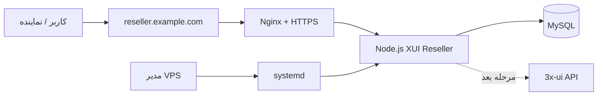
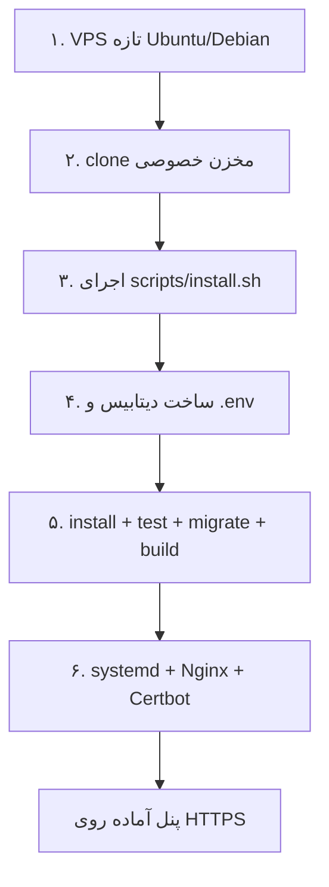
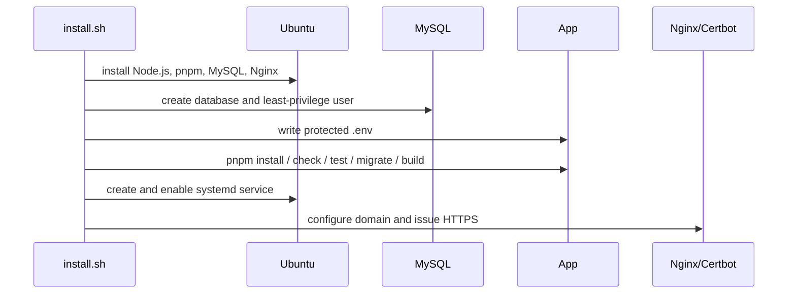
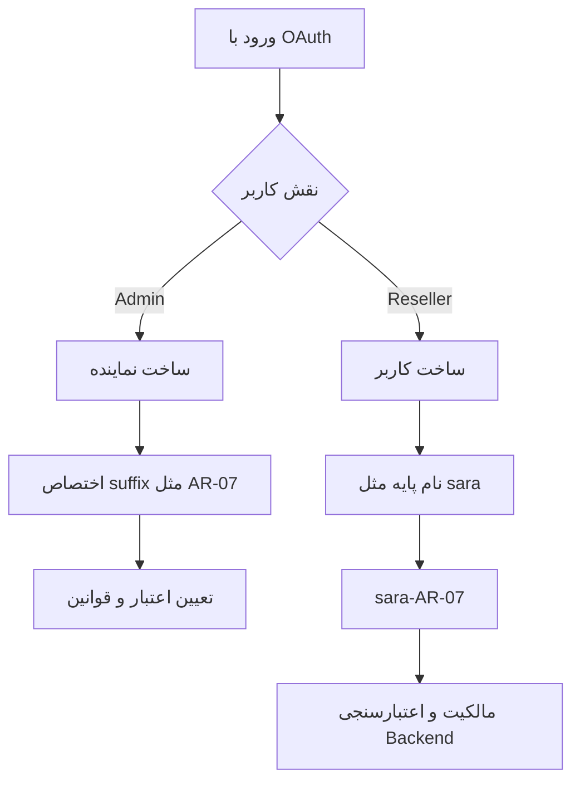
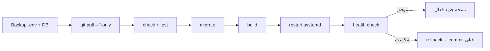

# آموزش تصویری نصب سریع

این راهنما مسیر نصب را به‌صورت تصویری نشان می‌دهد. برای نصب معمولی، فقط بخش **Quick Install** لازم است.

نسخه تصویری یک‌تکه: [دانلود پوستر نصب](visual-installation-guide.png)

## تصویر کلی معماری



## Quick Install در ۵ مرحله



### مرحله ۱: آماده‌کردن VPS

تصویر ذهنی صفحه SSH:

```text
┌──────────────────────────────────────────────┐
│ ubuntu@server:~$                            │
│ sudo apt update && sudo apt install ...     │
│                                              │
│ [########################] Done              │
└──────────────────────────────────────────────┘
```

دستور:

```bash
sudo apt update && sudo apt install -y curl git
```

### مرحله ۲: دریافت پروژه

```bash
git clone https://github.com/deragon02/xui-reseller-panel-pro.git
cd xui-reseller-panel-pro
```

اگر مخزن Private است، از Deploy Key یا Credential کم‌دسترسی استفاده کنید. Token را داخل URL یا فایل پروژه ننویسید.

### مرحله ۳: اجرای Quick Installer

```bash
sudo bash scripts/install.sh
```

نصب‌کننده مراحل زیر را خودش انجام می‌دهد:



در صورت داشتن دامنه، هنگام اجرا وارد کنید:

```text
Domain: reseller.example.com
Manus OAuth App ID: ********
```

یا به‌صورت غیرتعاملی:

```bash
sudo DOMAIN=reseller.example.com \
  VITE_APP_ID=YOUR_MANUS_APP_ID \
  bash scripts/install.sh
```

### مرحله ۴: بررسی سرویس

```bash
sudo systemctl status xui-reseller
```

نمایش سالم باید شبیه این باشد:

```text
● xui-reseller.service - XUI Reseller Panel
   Loaded: loaded (...; enabled)
   Active: active (running)
```

برای لاگ زنده:

```bash
sudo journalctl -u xui-reseller -f
```

### مرحله ۵: بررسی HTTPS

اگر DNS دامنه به VPS اشاره کند، نصب‌کننده Nginx و Certbot را تنظیم می‌کند:

```text
https://reseller.example.com
          │
          ▼
   ┌─────────────┐
   │ HTTPS / SSL │
   └──────┬──────┘
          ▼
   127.0.0.1:3000
```

اگر گواهی صادر نشد، معمولاً DNS هنوز آماده نیست یا پورت 80/443 بسته است. بعد از اصلاح DNS و Firewall اجرا کنید:

```bash
sudo certbot --nginx -d reseller.example.com
sudo certbot renew --dry-run
```

## مسیر استفاده داخل پنل



نمونه:

```text
نام پایه:       sara
کد نماینده:     AR-07
نام نهایی:      sara-AR-07
```

## به‌روزرسانی تصویری



دستور:

```bash
sudo mysqldump --single-transaction xui_reseller \
  | gzip | sudo tee /var/backups/xui-reseller-db.sql.gz >/dev/null

cd /opt/xui-reseller-panel
sudo APP_DIR=/opt/xui-reseller-panel \
  SERVICE_NAME=xui-reseller bash scripts/update.sh
```

## عیب‌یابی سریع

| نشانه | بررسی |
|---|---|
| سرویس `failed` است | `sudo journalctl -u xui-reseller -n 100 --no-pager` |
| صفحه باز نمی‌شود | `sudo systemctl status nginx` و `sudo nginx -t` |
| SSL صادر نمی‌شود | DNS دامنه، پورت 80 و پورت 443 را بررسی کنید |
| OAuth کار نمی‌کند | `VITE_APP_ID` و URLهای OAuth در `.env` را بررسی کنید |
| خطای دیتابیس | `DATABASE_URL`، رمز کاربر MySQL و وضعیت `mysql.service` را بررسی کنید |
| Update شکست خورد | commit قبلی و لاگ اسکریپت را بررسی کنید؛ اسکریپت rollback دارد |

## هشدار مهم

این MVP هنوز اتصال واقعی ساخت Client در 3x-ui را فعال نکرده است. نصب موفق پنل به‌معنای نصب یا تغییر پنل 3x-ui نیست. برای اتصال مرحله بعد باید API Docs نسخه دقیق 3x-ui، Tokenهای scoped، TLS و سیاست مالکیت بررسی و تست شوند.
